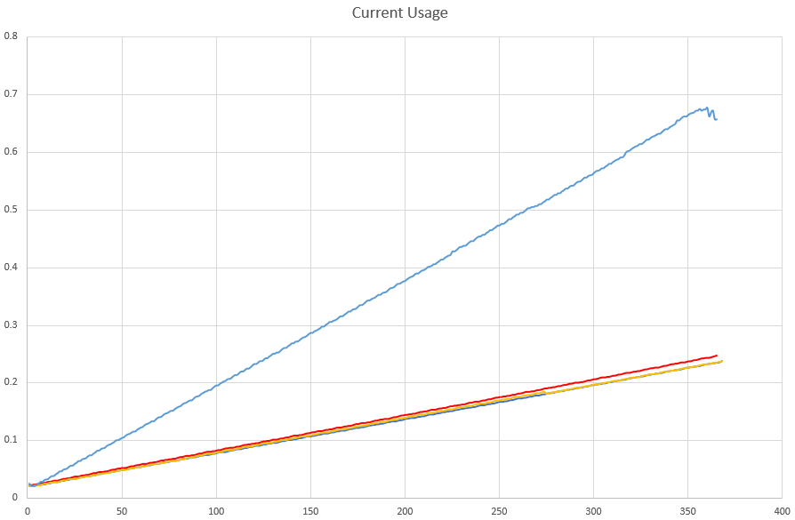

# SK6805-EC10-Notes

Notes on the __smallest__ availible addressable LED to date!

**Author's note:** While you will definitely need a loupe or microscope to even see what you're doing, these can be a bit easier to solder than the 3535 and other large sizes. If you choose a low-temp solder and gently use hot air, you can get each LED to snap into place onto the solder pads. 

Above, you can see the EC10 modules next to a 3535 LED. These guys are SMOL.

## KiCad Files
I made footprint and symbol files availible for the EC10s.  
They can be found in `\SK6805-EC10-kicad-libraries`  
There is no 3d model included, because it didn't add much and made it much harder to see if the mask was right.  

## Test Fixture
Since I couldn't find a pre-made strip of the EC10 modules, I decided to make one. This can be easily fabbed from your favorite fab house. 
Full KiCad 8 files can be found in `\EC10-Test-PCB` 

## Power Profiling
I soldered 48 of the modules to my test fixture (2 got blown away by the hot air gun).
**Note** use low-temp solder and gentle hot air. I was able to swim the modules into place on flux without breaking any of the lenses. At least on the 1515, if you get them too hot, the lens/case breaks. 

### Setup
I connected my 48x strip to a Siglent SPD-3303X PSU that quotes current reading of +- 0.3% + 10ma, while there may be tiny test errors, this should provide a good bassis for power calculations. 

I used 5V as a supply voltage.

### Methodology
I cycled Red, Green then Blue through 0-255 individually, while recording the power usage. Then I ran all three together to make white from 0-255. 

The code can be found in `\test-code` and is designed for a Teensy, but would work on any Arduino. 

We can see a linear and similar progression for R, G and B. Correspondingly, we see that consumption roughly tripling for white, which makes sense.

The idle current can also be charachterized from the first few data points.

## Power Formula
 

### Iconsumed=((R+B+G)*0.013838)+0.4791

Where:  
`Iconsumed` = Current consumed **per LED** in mA  
`(R+B+G)` = Values for R, G and B in 0-255  
`0.4791` = Idle current draw in mA per module  

## Compared To 1515 Size
These are a good amount smaller than the pettite 1515 size. I documented the features of those [on this repo](https://github.com/alorman/sk6805-1515-info).

Here are the two compared:  

